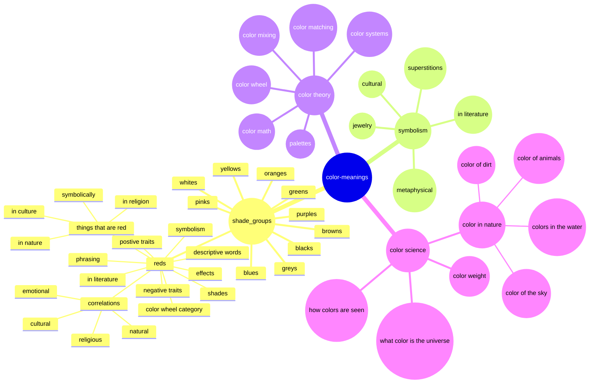

```mermaid

mindmap
  root((color-meanings))
    shade_groups((shade_groups))
        reds
            symbolism
            shades
            phrasing
            effects
            postive traits
            negative traits
            in literature
            descriptive words
            correlations
                natural
                cultural
                religious
                emotional
            things that are red
                in nature
                in culture
                in religion
                symbolically
            color wheel category
            
        oranges
        yellows
        greens
        blues
        purples
        pinks
        whites
        blacks
        browns
        greys
    symbolism_of_colors((symbolism))
      Cultural((cultural))
      Metaphysical((metaphysical))
      Superstitions((superstitions))
      jewlery((jewelry))
      literature((in literature))
    color_theory((color theory))
      color wheel((color wheel))
      color matching((color matching))
      color mixing((color mixing))
      color palettes((palettes))
      color systems((color systems))
      color math((color math))
    color_science((color science))
        color in nature((color in nature))
            animal colors((color of animals))
            earth colors((color of dirt))
            sky colors((color of the sky))
            water colors((colors in the water))
        colorimetry((what color is the universe))
        color weight((color weight))
        color and vision((how colors are seen))
```