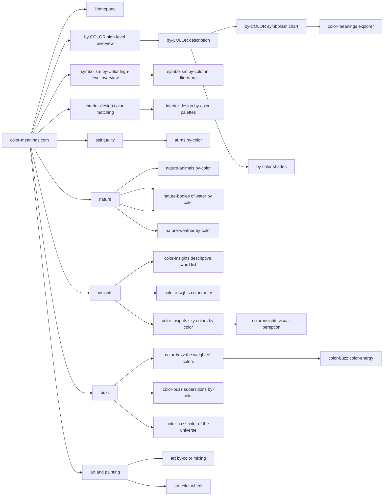

```mermaid
graph LR
    ROOT[color-meanings.com] --> A[Homepage]
    ROOT --> B[by-COLOR high-level overview]
    B --> C[by-COLOR description]
    C --> K[by-COLOR symbolism chart]
    K --> AG[color-meanings explorer]
    C --> D[by-color shades]
    ROOT --> E[symbolism by-Color high-level overview]
    E --> F[symbolism by-color in literature]
    ROOT --> L[interior-design color matching]
    L --> M[interior-design by-color palettes]
    ROOT --> N[spirituality]
    N --> O[auras by-color]
    ROOT --> P[nature]
    P --> Q[nature-animals by-color]
    P --> R[nature-plants by-color]
    P --> R[nature-bodies of water by color]
    P --> S[nature-weather by-color]
    ROOT --> T[insights]
    T --> U[color-insights descriptive word list]
    T --> V[color-insights colorimetry]
    T --> W[color-insights sky-colors by-color]
    W --> X[color-insights visual pereption]
    ROOT --> Y[buzz]
    Y --> Z[color-buzz the weight of colors]
    Y --> AA[color-buzz supersitions by-color]
    Y --> AB[color-buzz color of the universe]
    Z ---> AC[color-buzz color-energy]
    ROOT --> AD[art and painting]
    AD --> AE[art by-color mixing]
    AD --> AF[art color wheel]
```